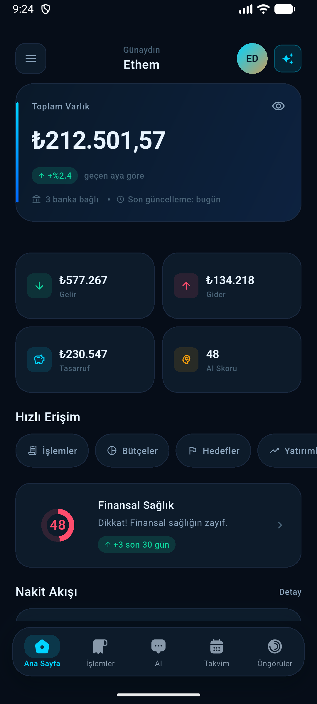
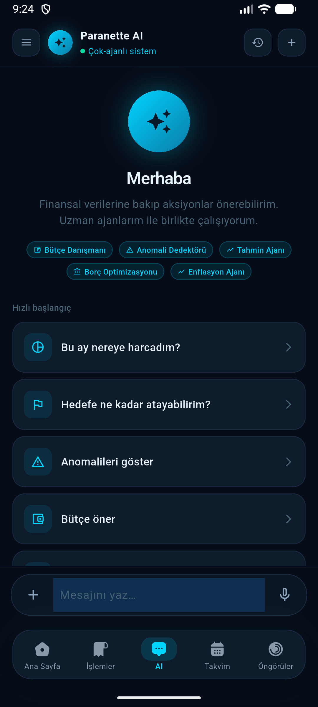
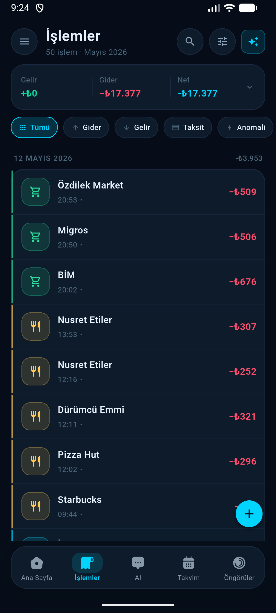
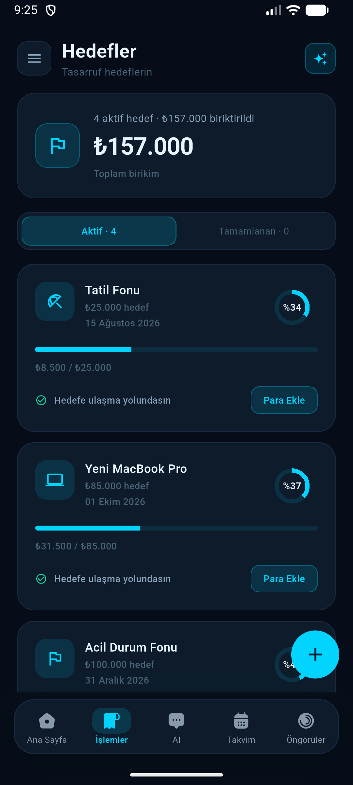
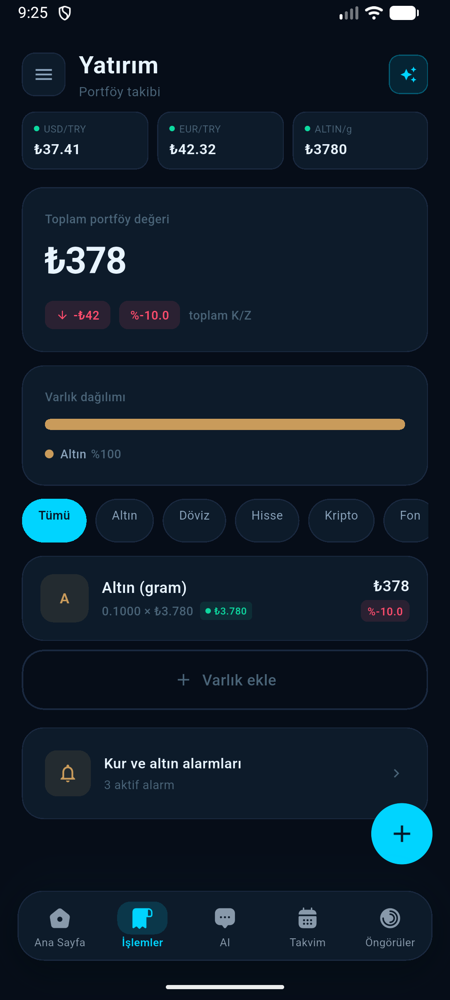
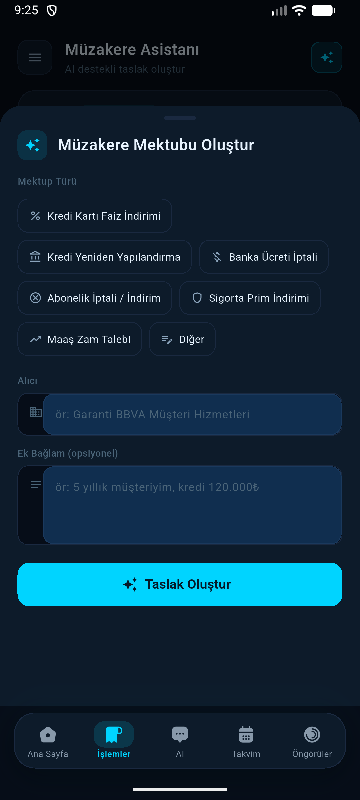
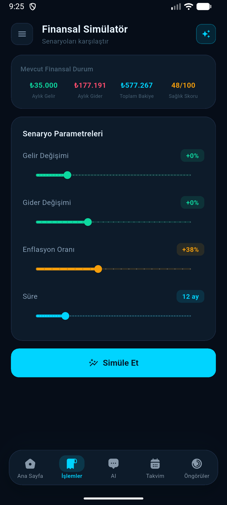
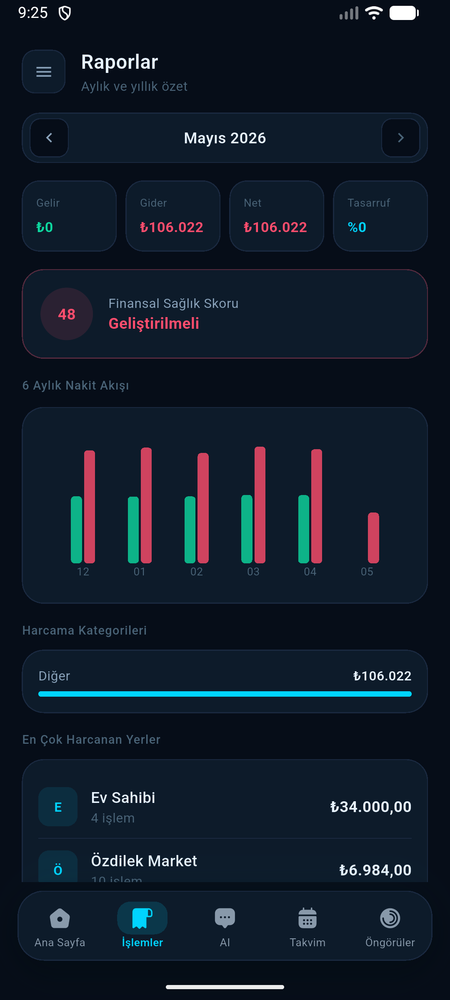

<div align="center">
# Paranette

### Yapay Zeka Destekli Kişisel Finans Asistanı

[](https://flutter.dev)
[](https://laravel.com)
[](https://ai.google.dev)
[](https://mysql.com)
[](LICENSE)

**BTK Akademi Hackathon 2026**

Türk bankalarından otomatik veri çeken, harcamalarını analiz eden, bütçe · hedef · yatırım takibi yapan ve **11 uzman AI ajanıyla** sohbet eden mobil kişisel finans uygulaması.

<br/>

[Kurulum](#-kurulum) · [Özellikler](#-özellikler) · [Mimari](#-mimari) · [Ekran Görüntüleri](#-ekran-görüntüleri) · [Takım](#-takım)

</div>

---

## 📸 Ekran Görüntüleri

<div align="center">
<table>
  <tr>
    <td align="center"><br/><sub><b>Dashboard</b></sub></td>
    <td align="center"><br/><sub><b>AI Asistan</b></sub></td>
    <td align="center"><br/><sub><b>İşlemler & OCR</b></sub></td>
    <td align="center"><br/><sub><b>Bütçe & Hedefler</b></sub></td>
  </tr>
  <tr>
    <td align="center"><br/><sub><b>Yatırım Portföyü</b></sub></td>
    <td align="center"><br/><sub><b>Müzakere Ajanı</b></sub></td>
    <td align="center"><br/><sub><b>Karar Simülatörü</b></sub></td>
    <td align="center"><br/><sub><b>Aylık Rapor</b></sub></td>
  </tr>
</table>
</div>

---

## ✨ Özellikler

### 🏦 Bankacılık & Hesaplar

| Özellik | Detay |
|---|---|
| **Banka Bağlantıları** | Ziraat, Garanti, İşbank, Akbank simülasyonu — otomatik işlem senkronizasyonu |
| **Çoklu Hesap** | Vadesiz, tasarruf, döviz hesabı konsolidasyonu |
| **Kartlar & Krediler** | Kart limiti takibi, kredi taksit takvimi |
| **Faturalar & Abonelikler** | 8 fatura türü, Netflix/Spotify gibi abonelikleri otomatik tespit |

### 🤖 Yapay Zeka

| Ajan | Görev |
|---|---|
| **BudgetAdvisor** | Gelir/gider analizi, bütçe önerileri |
| **AnomalyDetector** | Olağandışı harcama tespiti, 0–10 risk skoru |
| **NegotiationAgent** | Faiz indirimi ve borç yapılandırma için resmi AI mektubu |
| **InvestmentAdvisor** | Portföy önerileri, risk analizi |
| **InflationAdvisor** | Kişisel enflasyon vs. TÜFE karşılaştırması |
| **SavingsCoach** | Tasarruf hedefi oluşturma ve takibi |
| **DebtManager** | Kişisel borç yönetimi, otomatik tespit |
| **CalendarAdvisor** | Ödeme takvimi, yaklaşan yükümlülükler |
| **ReportGenerator** | Aylık finansal özet, PDF export |
| **ReceiptAnalyzer** | Kamera ile fiş okuma (Gemini Vision OCR) |
| **SimulatorAdvisor** | 3–12 aylık finansal projeksiyon |

### 📊 Planlama & Takip

- **Bütçe** — AI destekli bütçe önerisi, tek tıkla uygula
- **Hedefler** — Tasarruf hedefi oluştur, ilerlemeyi takip et
- **Yatırımlar** — Altın, döviz, kripto, BIST, fon canlı fiyatlarla
- **Kur & Altın Alarmları** — Eşik tabanlı anlık uyarılar
- **Karar Simülatörü** — "Bu parayı harcasam/yatırsam ne olur?" sorusunu yanıtla
- **Kişisel Enflasyon** — Harcama sepetine özel enflasyon endeksi

### 🔐 Güvenlik

- **PIN Koruması** — Zorunlu 6 haneli PIN, her açılışta doğrulama
- **Biyometrik Giriş** — Parmak izi / yüz tanıma (local_auth)
- **Şifreli Depolama** — flutter_secure_storage + SharedPreferences fallback

---

## 🏗 Mimari

```
┌─────────────────────────────────────────────────────┐
│                   Flutter Mobil                      │
│  Riverpod · GoRouter · Dio · local_auth · Gemini    │
└──────────────────────┬──────────────────────────────┘
                       │ HTTP/REST (Bearer Token)
┌──────────────────────▼──────────────────────────────┐
│              Laravel 13.7 API (PHP 8.3)              │
│                                                      │
│  ┌─────────────┐   ┌──────────────────────────────┐ │
│  │ 19 Controller│   │   11 AI Agent Service         │ │
│  │ REST Endpoints│  │   Gemini 2.5 Pro / Flash /    │ │
│  └─────────────┘   │   Vision                      │ │
│                    └──────────────────────────────┘ │
│  ┌─────────────────────────────────────────────────┐│
│  │  MySQL 8  ·  Laravel Sanctum  ·  Queue/Jobs    ││
│  └─────────────────────────────────────────────────┘│
└─────────────────────────────────────────────────────┘
         │
┌────────▼────────┐
│  Go Launcher    │  Windows · Linux · macOS
│  (cross-platform│  Otomatik kurulum + başlatma
│   binary)       │
└─────────────────┘
```

### Teknoloji Yığını

| Katman | Teknoloji | Versiyon |
|---|---|---|
| Mobil | Flutter · Dart | 3.41 · 3.11 |
| State | Riverpod | 2.6 |
| Routing | GoRouter | 14.6 |
| HTTP | Dio | 5.x |
| Backend | Laravel · PHP | 13.7 · 8.3 |
| Veritabanı | MySQL | 8.0 |
| Yapay Zeka | Google Gemini | 2.5 Pro |
| Auth | Laravel Sanctum | Bearer Token |
| Güvenlik | flutter_secure_storage | — |
| Biometrik | local_auth | 2.3 |
| Launcher | Go | 1.22 |

---

## 🚀 Kurulum

### Gereksinimler

| Araç | Versiyon |
|---|---|
| Flutter SDK | 3.19+ |
| PHP | 8.2+ |
| MySQL | 8.0+ |
| Android Studio + AVD | Ladybug+ |

### ⚡ Otomatik Kurulum (Önerilen)

`launcher/build/` dizininden platformunuza uygun dosyayı çalıştırın:

| Platform | Dosya |
|---|---|
| Windows 64-bit | `paranette-windows-amd64.exe` |
| Linux x86-64 | `paranette-linux-amd64` |
| Linux ARM64 | `paranette-linux-arm64` |
| macOS Intel | `paranette-macos-intel` |
| macOS Apple Silicon | `paranette-macos-arm64` |

Launcher otomatik olarak şunları yapar:
1. PHP · MySQL · Flutter · ADB yollarını tespit eder
2. MySQL hazır değilse WAMP'ı başlatıp bekler
3. `php artisan serve` ile Laravel'i `http://127.0.0.1:8000` adresinde başlatır
4. Bağlantı modunu sorar → emülatör / fiziksel cihaz / manuel IP
5. Mevcut AVD listesini gösterir, seçilen emülatörü başlatır
6. `--dart-define=API_HOST=...` ile Flutter uygulamasını çalıştırır

### 🔧 Manuel Kurulum

<details>
<summary><strong>1 — Laravel Backend</strong></summary>

```bash
cd web
cp .env.example .env
composer install
php artisan key:generate
php artisan migrate --seed
php artisan serve --host=0.0.0.0 --port=8000
```

**Zorunlu `.env` değerleri:**
```env
DB_DATABASE=paranette
DB_USERNAME=root
DB_PASSWORD=          # WAMP varsayılan: boş
GEMINI_API_KEY=       # aistudio.google.com
```

</details>

<details>
<summary><strong>2 — Flutter Mobil</strong></summary>

```bash
cd mobile
flutter pub get

# Android emülatör (varsayılan):
flutter run --dart-define=API_HOST=10.0.2.2

# Fiziksel cihaz (bilgisayarın LAN IP'si):
flutter run --dart-define=API_HOST=192.168.x.x
```

> **İpucu:** Uygulama içinde de değiştirilebilir — giriş ekranındaki **"API: …:8000"** çipine dokun.

</details>

---

## 📁 Proje Yapısı

```
btk-hackathon-2026/
├── web/                          # Laravel 13.7 backend
│   ├── app/Http/Controllers/Api/ # 19 REST controller
│   ├── app/Services/Agents/      # 11 AI ajan servisi
│   ├── database/migrations/      # 24 migration
│   └── routes/api.php
│
├── mobile/                       # Flutter uygulaması
│   └── lib/
│       ├── core/                 # API · router · tema · widget
│       │   ├── api/              # Dio client, interceptors, endpoints
│       │   ├── routes/           # GoRouter (ShellRoute + auth guards)
│       │   ├── storage/          # Secure storage + SharedPrefs
│       │   └── theme/            # Dark / light token sistemi
│       └── features/             # 22 özellik modülü (feature-first)
│           ├── auth/             # Splash · Login · Register · PIN · Biometric
│           ├── dashboard/
│           ├── agent_chat/       # AI sohbet (11 ajan)
│           ├── bank_connections/
│           ├── transactions/
│           ├── budgets/
│           ├── goals/
│           ├── investments/
│           ├── negotiation/
│           ├── simulator/
│           ├── inflation/
│           └── ...
│
├── launcher/                     # Go cross-platform başlatıcı
│   ├── main.go
│   ├── platform_windows.go
│   ├── platform_unix.go
│   └── build/                    # 5 platform için derlenmiş binary
│
└── docs/
    ├── screenshots/              # Uygulama ekran görüntüleri
    ├── PARANETTE_MOBIL.md        # Mobil geliştirici notları
    ├── PARANETTE_WEB.md          # Backend geliştirici notları
    └── VIDEO_SCRIPT.md           # 2 dakikalık tanıtım video senaryosu
```

---

## 👥 Takım

<div align="center">

| | İsim | Rol |
|:---:|:---|:---|
| 👨‍💻 | **Ethem Demirkaya** | Backend · Laravel · AI Ajanlar · Go Launcher |
| 👩‍💻 | **Sinem Çağman** | Mobil · Flutter · UI/UX |

</div>

---

<div align="center">

**BTK Akademi Hackathon 2026**

*Finansal özgürlüğün yapay zeka ile buluştuğu yer.*

[](https://github.com/ethemdemirkaya/btk-hackathon-2026)

</div>
